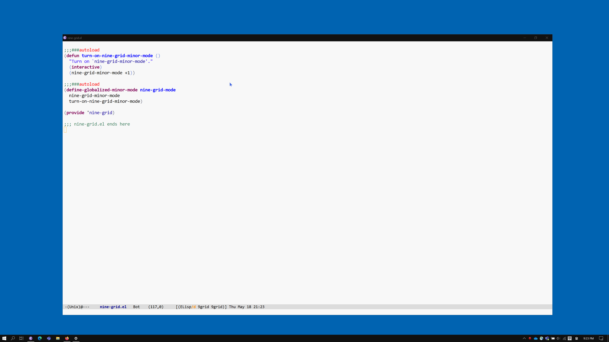

# nine-grid (9g)

Move frame to one of 9 grids in screen.

## Demo



## Installation

```elisp
(add-to-list 'load-path "<path-to-nine-grid>")
(require 'nine-grid)
(nine-grid-mode)
```

Or

```elisp
(use-package nine-grid
  :load-path "~/.emacs.d/site-lisp/nine-grid"
  :config
  (require 'nine-grid)
  (nine-grid-mode))
```

## Contributors

<a href = "https://github.com/kimim/pdf-view-pagemark/graphs/contributors">
  
</a>
